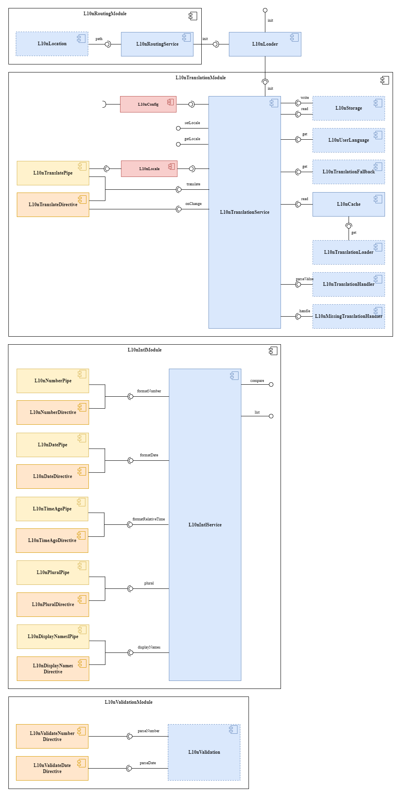

# Angular l10n
[](https://travis-ci.org/robisim74/angular-l10n) [](https://badge.fury.io/js/angular-l10n) [](https://www.npmjs.com/package/angular-l10n) [](https://www.npmjs.com/package/angular-l10n)
> An Angular library to translate texts, dates and numbers

This library is for localization of **Angular** apps. It allows, in addition to translation, to format dates and numbers through [Internationalization API](https://developer.mozilla.org/en-US/docs/Web/JavaScript/Reference/Global_Objects/Intl)


## Documentation
[Angular l10n Specification](https://robisim74.github.io/angular-l10n/)


## Architecture



## Table of Contents
- [Installation](#installation)
- [Usage](#usage)
- [Types](#types)
- [Intl API](#intl-api)
- [Previous versions](#previous-versions)
- [Contributing](#contributing)
- [License](#license)


## Installation
```Shell
npm install angular-l10n --save 
```


## Usage
You can find a complete sample app [here](projects/angular-l10n-app)

### Configuration
Create the configuration:
```TypeScript
export const l10nConfig: L10nConfig = {
    format: 'language-region',
    providers: [
        { name: 'app', asset: i18nAsset }
    ],
    cache: true,
    keySeparator: '.',
    defaultLocale: { language: 'en-US', currency: 'USD' },
    schema: [
        { locale: { language: 'en-US', currency: 'USD' }, dir: 'ltr', text: 'United States' },
        { locale: { language: 'it-IT', currency: 'EUR' }, dir: 'ltr', text: 'Italia' }
    ]
};

export function initL10n(l10nLoader: L10nLoader): () => Promise<void> {
    return () => l10nLoader.init();
}

const i18nAsset = {
    'en-US': {
        greeting: "Hello world!",
        whoIAm: "I am {{name}}"
    },
    'it-IT': {
        greeting: "Ciao mondo!",
        whoIAm: "Sono {{name}}"
    }
};
```
Import the modules and the configuration:
```TypeScript
@NgModule({
    ...
    imports: [
        ...
        L10nTranslationModule.forRoot(l10nConfig),
        L10nIntlModule
    ],
    providers: [
        {
            provide: APP_INITIALIZER,
            useFactory: initL10n,
            deps: [L10nLoader],
            multi: true
        }
    ],
    bootstrap: [AppComponent]
})
export class AppModule { }
```

### Getting the translation
#### Pure Pipes
```Html
<p title="{{ 'greeting' | translate:locale.language }}">{{ 'greeting' | translate:locale.language }}</p>
<p>{{ 'whoIAm' | translate:locale.language:{ name: 'Angular l10n' } }}</p>

<p>{{ today | l10nDate:locale.language:{ dateStyle: 'full', timeStyle: 'short' } }}</p>

<p>{{ value | l10nNumber:locale.language:{ digits: '1.2-2', style: 'currency' } }}</p>
```
Pure pipes need to know when the _locale_ changes. So import `L10nLocale` injection token in the component:
```TypeScript
export class AppComponent {

    constructor(@Inject(L10N_LOCALE) public locale: L10nLocale) { }

}
```
##### OnPush Change Detection Strategy
To support this strategy, there is an async version of each pipe:
```Html
<p>{{ 'greeting' | translateAsync }}</p>
```
#### Directives
```Html
<p l10n-title title="greeting" l10nTranslate>greeting</p>
<p [params]="{ name: 'Angular l10n' }" l10nTranslate>whoIAm</p>

<p [options]="{ dateStyle: 'full', timeStyle: 'short' }" l10nDate>{{ today }}</p>
<p [options]="{ digits: '1.2-2', style: 'currency' }" l10nNumber>{{ value }}</p>
```
#### APIs
```TypeScript
export class AppComponent implements OnInit {

    constructor(private translation: L10nTranslationService, private intl: L10nIntlService) { }

    ngOnInit() {
        // Fired every time the translation data has been loaded.
        this.translation.onChange().subscribe({
            next: () => {
                // Gets the translations.
                this.greeting = this.translation.translate('greeting');
                this.whoIAm = this.translation.translate('whoIAm', { name: 'Angular l10n' });

                // Formats dates & numbers.
                this.formattedToday = this.intl.formatDate(this.today, { dateStyle: 'full', timeStyle: 'short' });
                this.formattedValue = this.intl.formatNumber(this.value, { digits: '1.2-2', style: 'currency' });
            }
        });

        // Fired when the translation data could not been loaded.
        this.translation.onError().subscribe({
            next: (error: any) => {
                if (error) console.log(error);
            }
        });
    }

    // Changes the current locale and load the translation data.
    setLocale(locale: L10nLocale): void {
        this.translation.setLocale(locale);
    }

}
```
### Customize the library
The following features can be customized. You just have to implement the indicated class-interface and pass the token during configuration.

E.g.
```TypeScript
@Injectable() export class HttpTranslationLoader implements L10nTranslationLoader {

    private headers = new HttpHeaders({ 'Content-Type': 'application/json' });

    constructor(@Optional() private http: HttpClient) { }

    public get(language: string, provider: L10nProvider): Observable<{ [key: string]: any }> {
        const url = `${provider.asset}-${language}.json`;
        const options = {
            headers: this.headers,
            params: new HttpParams().set('v', provider.options.version)
        };
        return this.http.get(url, options);
    }

}

export const l10nConfig: L10nConfig = {
    ...
    providers: [
        { name: 'app', asset: './assets/i18n/app', options: { version: '1.0.0' } },
    ],
    ...
};

@NgModule({
    ...
    imports: [
        ...
        L10nTranslationModule.forRoot(
            l10nConfig,
            {
                translationLoader: HttpTranslationLoader
            }
        )
    ],
    ...
})
export class AppModule { }
```

#### Storage
By default, the library does not store the _locale_. To store it implement the `L10nStorage` class-interface, so that the next time the user has the _locale_ he selected.
#### User Language
By default, the library attempts to set the _locale_ using the user's browser language, before falling back on the _default locale_. You can change this behavior by implementing the `L10nUserLanguage` class-interface, for example to get the language via server.
#### Translation Loader
By default, you can only pass JavaScript objects as translation data provider. To implement a different loader, you can implement the `L10nTranslationLoader` class-interface, as in the example above.
#### Translation Fallback
You can enable translation fallback during configuration:
```TypeScript
export const l10nConfig: L10nConfig = {
    ...
    fallback: true,
    ...
};
```
By default, the translation data will be merged in the following order:
- `'language'`
- `'language[-script]'`
- `'language[-script][-country]'`

To change it, implement the `L10nTranslationFallback` class-interface.
#### Translation Handler
By default, the library only parse the _params_. `L10nTranslationHandler` is the class-interface to implement to modify the behavior.
#### Missing Translation Handler
If a key is not found, the same key is returned. To return a different value, you can implement the `L10nMissingTranslationHandler` class-interface.
### Validation
There are two directives, that you can use with Template driven or Reactive forms: `l10nValidateNumber` and `l10nValidateDate`. To use them, you have to implement the `L10nValidation` class-interface, and import it with the validation module:
```TypeScript
@Injectable() export class LocaleValidation implements L10nValidation {

    constructor(@Inject(L10N_LOCALE) private locale: L10nLocale) { }

    public parseNumber(value: string, options?: L10nNumberFormatOptions, language = this.locale.language): number | null {
        ...
    }

    public parseDate(value: string, options?: L10nDateTimeFormatOptions, language = this.locale.language): Date | null {
        ...
    }

}

@NgModule({
    ...
    imports: [
        ...
        L10nValidationModule.forRoot({ validation: LocaleValidation })
    ],
    ...
})
export class AppModule { }
```

### Routing
You can enable the localized routing importing the routing module after others:
```TypeScript
@NgModule({
    ...
    imports: [
        ...
        L10nRoutingModule.forRoot()
    ],
    ...
})
export class AppModule { }
```
A prefix containing the language is added to the path of each navigation, creating a semantic URL:
```
baseHref/[language][-script][-country]/path

https://example.com/en/home
https://example.com/en-US/home
```
If the localized link is called, the _locale_ is also set automatically.

To achieve this, the router configuration in your app is not rewritten: the URL is replaced, in order to provide the different localized contents both to the crawlers and to the users that can refer to the localized links.

If you don't want a localized routing for _default locale_, you can enable it during the configuration:
```TypeScript
export const l10nConfig: L10nConfig = {
    ...
    defaultRouting: true
};
```


## Types
Angular l10n types that it is useful to know:
- `L10nLocale`: contains a _language_, in the format `language[-script][-region][-extension]`, where:
     - language: ISO 639 two-letter or three-letter code
     - script: ISO 15924 four-letter script code
     - region: ISO 3166 two-letter, uppercase code
     - extension: 'u' (Unicode) extensions
     
     Optionally a ISO 4217 three-letter code _currency_ and a _timezone_ from the IANA time zone database
- `L10nFormat`: shows the format of the _language_ to be used for translations. The supported formats are: `'language' | 'language-script' | 'language-region' | 'language-script-region'`. So, for example, you can have a _language_ like `en-US-u-ca-gregory-nu-latn` to format dates and numbers, but only use the `en-US` for translations setting `'language-region'`
- `L10nDateTimeFormatOptions`: the type of _options_ used to format dates. Extends the Intl `DateTimeFormatOptions` interface, adding the _dateStyle_ and _timeStyle_ attributes
- `L10nNumberFormatOptions`: the type of _options_ used to format numbers. Extends the Intl `NumberFormatOptions` interface, adding the _digits_ attribute


## Intl API
To format dates and numbers, this library uses the [Intl API](https://developer.mozilla.org/en-US/docs/Web/JavaScript/Reference/Global_Objects/Intl)

Check the current browser support:
- [ECMAScript compatibility tables](http://kangax.github.io/compat-table/esintl/)
- [Can I use](http://caniuse.com/#feat=internationalization)

All modern browsers have implemented this API. You can use a polyfill like [Polyfill.io](https://polyfill.io/v3/) to extend support to old browsers.

Just add one script tag in your `index.html`:
```Html
<script crossorigin="anonymous"
    src="https://polyfill.io/v3/polyfill.min.js?flags=gated&features=Intl.~locale.en-US"></script>
```
When specifying the `features`, you have to specify what languages to load.

Other polyfills:
- For _timezone_: [Intl.DateTimeFormat timezone](https://github.com/formatjs/date-time-format-timezone)
- For _timeAgo_ pipe and directive: [Intl.RelativeTimeFormat](https://www.npmjs.com/package/@formatjs/intl-relativetimeformat)

The `L10nIntlService` also provides methods for other APIs, such as _Collator_, _PluralRules_ and _ListFormat_.


## Previous versions
- **Angular v8 (Angular l10n v8.1.2)**
    - [Branch](https://github.com/robisim74/angular-l10n/tree/angular_v8/docs)

- **Angular v7 (Angular l10n v7.2.0)**
    - [Branch](https://github.com/robisim74/angular-l10n/tree/angular_v7/docs)

- **Angular v6 (Angular l10n v5.2.0)**
    - [Branch](https://github.com/robisim74/angular-l10n/tree/angular_v6/docs)

- **Angular v5 (Angular l10n v4.2.0)**
    - [Branch](https://github.com/robisim74/angular-l10n/tree/angular_v5/docs)

- **Angular v4 (Angular l10n v3.5.2)**
    - [Branch](https://github.com/robisim74/angular-l10n/tree/angular_v4)

- **Angular v2 (Angular l10n v2.0.11)**
    - [Branch](https://github.com/robisim74/angular-l10n/tree/angular_v2)


## Contributing
- Building the library:
    ```Shell
    npm install
    npm run build
    ```

- Testing:
    ```Shell
    npm test
    ```

- Serving the sample app:
    ```Shell
    npm start
    ```


## License
MIT
