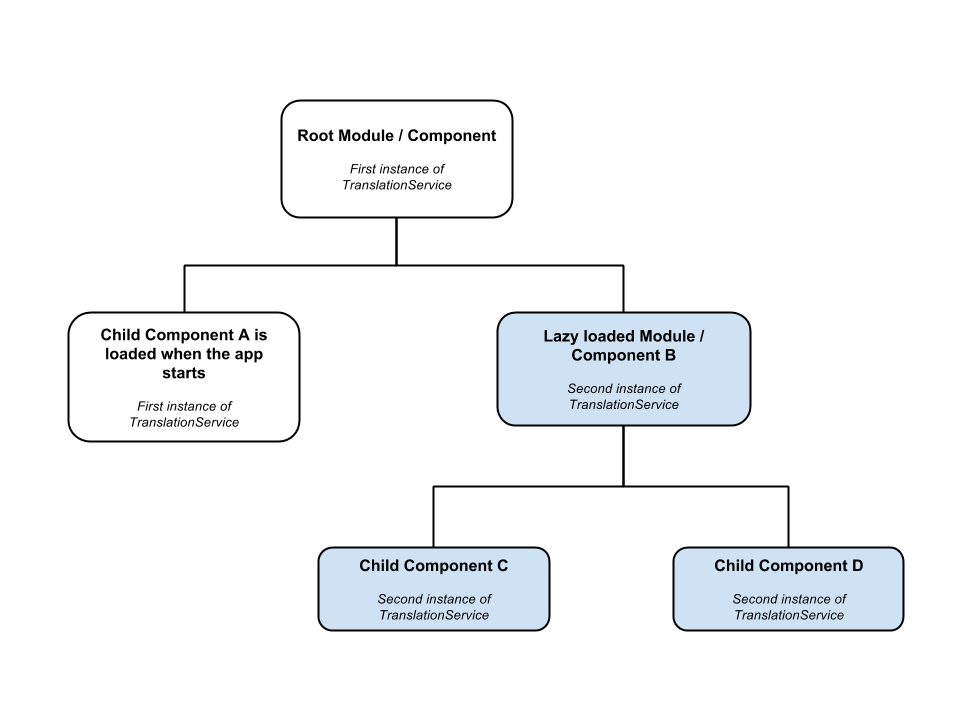

# Angular localization library specification
Library version: 2.0.9

## Table of contents
* [1 Library structure](#1)
* [2 Configuration](#2)
    * [2.1 First scenario: you only need to translate messages](#2.1)
    * [2.2 Second scenario: you need to translate messages, dates & numbers](#2.2)
    * [2.3 Loading the translation data](#2.3)
    * [2.4 Default locale](#2.4)
    * [2.5 Intl API](#2.5)
* [3 Getting the translation](#3)
    * [3.1 Pure pipes](#3.1)
        * [3.1.1 Messages](#3.1.1)
        * [3.1.2 Dates & Numbers](#3.1.2)
        * [3.1.3 OnPush ChangeDetectionStrategy](#3.1.3)
    * [3.2 Directives](#3.2)
    * [3.3 Getting the translation in component class](#3.3)
* [4 Changing language, default locale or currency at runtime](#4)
* [5 Lazy loading](#5)
* [6 Validation by locales](#6)
    * [6.1 Validating a number](#6.1)
        * [6.1.1 Parsing a number](#6.1.1)
        * [6.1.2 FormBuilder](#6.1.2)
* [7 Collator](#7)
* [8 Services APIs](#8)
    * [8.1 LocaleService](#8.1)
    * [8.2 TranslationService](#8.2)
    * [8.3 LocaleValidation](#8.3)
    * [8.4 Collator](#8.4)
    * [8.5 IntlAPI](#8.5)

## <a name="1"/>1 Library structure
This library has the following classes:

Class | Contract
----- | --------
`LocaleService` | Manages language, default locale & currency
`TranslationService` | Manages the translation data
`Translation` | Extend this class in components to provide _lang_ to the _translate_ pipe
`Localization` | Extend this class in components to provide _lang_, _defaultLocale_ & _currency_ to the translate and locale pipes
`LocaleValidation` | Provides the methods to convert strings according to default locale
`Collator` | Intl.Collator APIs
`IntlAPI` | Provides the methods to check if Intl APIs are supported

## <a name="2"/>2 Configuration
### <a name="2.1"/>2.1 First scenario: you only need to translate messages
Import the modules you need in the application root module:
```TypeScript
@NgModule({
    imports: [
        ...
        HttpModule,
        TranslationModule.forRoot()
    ],
    declarations: [AppComponent],
    bootstrap: [AppComponent]
})
export class AppModule { }
```
Configure the services in the application root module or bootstrap component:
```TypeScript
constructor(public locale: LocaleService, public translation: TranslationService) {
    this.locale.AddConfiguration()
        .AddLanguages(['en', 'it'])
        .SetCookieExpiration(30)
        .DefineLanguage('en');
    this.locale.init();

    this.translation.AddConfiguration()
        .AddProvider('./assets/locale-');
    this.translation.init();
}
```
### <a name="2.2"/>2.2 Second scenario: you need to translate messages, dates & numbers
Import the modules you need in the application root module:
```TypeScript
@NgModule({
    imports: [
        ...
        HttpModule,
        LocalizationModule.forRoot()
    ],
    declarations: [AppComponent],
    bootstrap: [AppComponent]
})
export class AppModule { }
```
Configure the services in the application root module or bootstrap component:
```TypeScript
constructor(public locale: LocaleService, public translation: TranslationService) {
    this.locale.AddConfiguration()
        .AddLanguages(['en', 'it'])
        .SetCookieExpiration(30)
        .DefineDefaultLocale('en', 'US')
        .DefineCurrency('USD');
    this.locale.init();

    this.translation.AddConfiguration()
        .AddProvider('./assets/locale-');
    this.translation.init();
}
```

#### LocaleService: AddConfiguration APIs 
Method | Function
------ | --------
`AddLanguage(languageCode: string, textDirection?: string);` | Adds a language to use in the app, specifying the layout direction
`AddLanguages(languageCodes: string[]);` | Adds the languages to use in the app
`DisableStorage();` | Disables the browser storage for language, default locale & currency
`SetCookieExpiration(days?: number);` | If the cookie expiration is omitted, the cookie becomes a session cookie
`UseLocalStorage();` | Sets browser LocalStorage as default for language, default locale & currency
`DefineLanguage(languageCode: string);` | Defines the language to be used
`DefineDefaultLocale(languageCode: string, countryCode: string, scriptCode?: string, numberingSystem?: string, calendar?: string);` | Defines the default locale to be used, regardless of the browser language
`DefineCurrency(currencyCode: string);` | Defines the currency to be used

#### TranslationService: AddConfiguration APIs
Method | Function
------ | --------
`AddTranslation(languageCode: string, translation: any);` | Direct loading: adds translation data
`AddProvider(prefix: string, dataFormat?: string);` |  Asynchronous loading: adds a translation provider
`AddWebAPIProvider(path: string, dataFormat?: string);` |  Asynchronous loading: adds a Web API provider
`UseLocaleAsLanguage();` | Sets the use of locale (`languageCode-countryCode`) as language
`SetMissingValue(value: string);` | Sets the value to use for missing keys
`SetMissingKey(key: string);` | Sets the key to use for missing keys
`SetComposedKeySeparator(keySeparator: string);` | Sets composed key separator. Default is the point '.'

### <a name="2.3"/>2.3 Loading the translation data
#### Direct loading
You can use `AddTranslation` when you configure the service, 
adding all the translation data:
```TypeScript
const translationEN = {
     Title: 'Angular localization'
}
const translationIT = {
     Title: 'Localizzazione in Angular'
}

this.translation.AddConfiguration()
    .AddTranslation('en', translationEN)
    .AddTranslation('it', translationIT);
```

#### Asynchronous loading of json files
You can add all the providers you need:
```TypeScript
this.translation.AddConfiguration()
    .AddProvider('./assets/locale-')
    .AddProvider('./assets/global-')
    ...
```
*N.B. You can't use Direct and Asynchronous loading at the same time.*

#### Asynchronous loading through a Web API
You can also load the data through a Web API:
```TypeScript
this.translation.AddConfiguration()
    .AddWebAPIProvider('http://localhost:54703/api/values/');

this.translation.translationError.subscribe((error: any) => console.log(error));

this.translation.init();
```
`[path]{languageCode}` will be the URL used by the Http GET requests. So the example URL will be something like: `http://localhost:54703/api/values/en`.

The example above also showed as you can perform a custom action if you get a bad response.

### <a name="2.4"/>2.4 Default locale
The default locale contains the current language and culture. It consists of:
* `language code`: ISO 639 two-letter or three-letter code of the language;
* `country code`: ISO 3166 two-letter, uppercase code of the country;

and optionally:
- `script code`: used to indicate the script or writing system variations that distinguish the written forms of a language or its dialects. It consists of four letters and was defined according to the assignments found in ISO 15924;
- `numbering system`: possible values include: "arab", "arabext", "bali", "beng", "deva", "fullwide", "gujr", "guru", "hanidec", "khmr", "knda", "laoo", "latn", "limb", "mlym", "mong", "mymr", "orya", "tamldec", "telu", "thai", "tibt";
- `calendar`: possible values include: "buddhist", "chinese", "coptic", "ethioaa", "ethiopic", "gregory", "hebrew", "indian", "islamic", "islamicc", "iso8601", "japanese", "persian", "roc".

For more information see [Intl API](https://developer.mozilla.org/en-US/docs/Web/JavaScript/Reference/Global_Objects/Intl).

### <a name="2.5"/>2.5 Intl API
To localize dates and numbers, this library uses [Intl API](https://developer.mozilla.org/it/docs/Web/JavaScript/Reference/Global_Objects/Intl), through Angular. 
All modern browsers have implemented this API. You can use [Intl.js](https://github.com/andyearnshaw/Intl.js) to extend support to all browsers. 
Just add one script tag in your `index.html`:
```Html
<script src="https://cdn.polyfill.io/v2/polyfill.min.js?features=Intl.~locale.en-US"></script>
```
When specifying the `features`, you have to specify what locale, or locales to load.

*N.B. When a feature is not supported, however, for example in older browsers, Angular localization does not generate an error in the browser, but returns the value without performing operations.*

## <a name="3"/>3 Getting the translation
To get the translation, this library uses _pure pipes_ (to know the difference between _pure_ and _impure pipes_ see [here](https://angular.io/docs/ts/latest/guide/pipes.html)) or directives. 
You can also get the translation in component class.

### <a name="3.1"/>3.1 Pure pipes
Type | Format | Pipe syntax
---- | ------ | -----------
Message | String | `expression | translate:lang`
Date | Date/Number/ISO string | `expression | localeDate[:defaultLocale[:format]]`
Number | Decimal | `expression | localeDecimal[:defaultLocale[:digitInfo]]`
Number | Percentage | `expression | localePercent[:defaultLocale[:digitInfo]]`
Number | Currency | `expression | localeCurrency[:defaultLocale[:currency[:symbolDisplay[:digitInfo]]]]`

#### <a name="3.1.1"/>3.1.1 Messages
```
expression | translate:lang
```
where `expression` is a string key that indicates the message to translate:
```Html
{{ 'Title' | translate:lang }}
```
_Json_:
```
{
    "Title": "Angular localization"
}
```
Extend `Translation` class in the component to provide _lang_ to the _translate_ pipe:
```TypeScript
export class HomeComponent extends Translation {

    constructor(public translation: TranslationService) {
        super(translation);
        ...
    }

} 
```
##### Composed keys
```Html
{{ 'Home.Title' | translate:lang }}
```
_Json_:
```
{
    "Home": {
        "Title": "Angular localization"
    }
}
```
##### Parameters
```Html
{{ 'User notifications' | translate:lang:{ user: username, NoMessages: messages.length } }}
```
_Json_:
```
{
    "User notifications": "{{ user }}, you have {{ NoMessages }} new messages"
}
```

#### <a name="3.1.2"/>3.1.2 Dates & Numbers
Extend `Localization` class in the component to provide _defaultLocale_ & _currency_ to the locale pipes:
```TypeScript
export class HomeComponent extends Localization {

    constructor(public locale: LocaleService, public translation: TranslationService) {
        super(locale, translation);
        ...
    }

} 
```
##### Dates
```
expression | localeDate[:defaultLocale[:format]]
```
where `expression` is a date object or a number (milliseconds since UTC epoch) or an ISO string, and `format` indicates which date/time components to include. 
See Angular [DatePipe](https://angular.io/docs/ts/latest/api/common/index/DatePipe-pipe.html) for further information.
```Html
{{ today | localeDate:defaultLocale:'fullDate' }}
```
##### Decimals
```
expression | localeDecimal[:defaultLocale:[digitInfo]]
```
where `expression` is a number and `digitInfo` has the following format: `{minIntegerDigits}.{minFractionDigits}-{maxFractionDigits}`. 
See Angular [DecimalPipe](https://angular.io/docs/ts/latest/api/common/index/DecimalPipe-pipe.html) for further information.

```Html
{{ value | localeDecimal:defaultLocale:'1.5-5' }}
```
##### Percentages
```
expression | localePercent[:defaultLocale:[digitInfo]]
```
```Html
{{ value | localePercent:defaultLocale:'1.1-1' }}
```
##### Currencies
```
expression | localeCurrency[:defaultLocale[:currency[:symbolDisplay[:digitInfo]]]]
```
where `symbolDisplay` is a boolean indicating whether to use the currency symbol (e.g. $) or the currency code (e.g. USD) in the output. 
```Html
{{ value | localeCurrency:defaultLocale:currency:true:'1.2-2' }}
```
*N.B. You can dynamically change parameters and expressions values.*

#### <a name="3.1.3"/>3.1.3 OnPush ChangeDetectionStrategy
_Pure pipes_ don't need to set `ChangeDetectionStrategy` to `OnPush`: if into your components you need to use it for working with other _impure pipes_, when you extend `Translation` or `Localization` classes you have also to pass `ChangeDetectorRef`:
```TypeScript
export class HomeComponent extends Localization {

    constructor(public locale: LocaleService, public translation: TranslationService, public cd: ChangeDetectorRef) {
        super(locale, translation, cd);
        ...
    }

} 
```

### <a name="3.2"/>3.2 Directives
Type | Format | Html syntax
---- | ------ | -----------
Message | String | `<tagname translate>expression</tagname>`
Date | Date/Number/ISO string | `<tagname localeDate="[format]">expression</tagname>`
Number | Decimal | `<tagname localeDecimal="[digitInfo]">expression</tagname>`
Number | Percentage | `<tagname localePercent="[digitInfo]">expression</tagname>`
Number | Currency | `<tagname localeCurrency="[digitInfo]" [symbol]="[symbolDisplay]">expression</tagname>`

##### Messages
```Html
<h1 translate>Title</h1>
```
Parameters:
```Html
<p [translate]="{ user: username, NoMessages: messages.length }">User notifications</p>
```
##### Dates & numbers
```Html
<p localeDate>{{ today }}</p>
<p localeDate="fullDate">{{ today }}</p>

<p localeDecimal>{{ value }}</p>
<p localeDecimal="1.5-5">{{ value }}</p>

<p localePercent>{{ value }}</p>
<p localePercent="1.1-1">{{ value }}</p>

<p localeCurrency>{{ value }}</p>
<p localeCurrency="1.2-2" [symbol]="true">{{ value }}</p>
```
*N.B. You can dynamically change attributes, parameters and expressions values. 
If you use in the component only the directives and not the pipes, 
you don't need to import services and extend `Translation` or `Localization` class.*

### <a name="3.3"/>3.3 Getting the translation in component class
To get the translation in component class, `TranslationService` has the following methods:
* `translate(key: string, args?: any, lang?: string): string;`
* `translateAsync(key: string, args?: any, lang?: string): Observable<string>;`

But to get the translation _when the component is loaded_ and _when the current language changes_, 
_you must also_ subscribe to the following event:
* `translationChanged: EventEmitter<string>;`

```TypeScript
@Component({
    template: '<h1>{{ title }}</h1>'
})
export class HomeComponent {

    // Initializes 'title' with the current translation at the time of the component loading.
    public title: string = this.translation.translate('Title');

    constructor(public translation: TranslationService) {
        this.translation.translationChanged.subscribe(
            // When the language changes, refreshes 'title' with the new translation.
            () => { this.title = this.translation.translate('Title'); }
        );
    }

}
```

## <a name="4"/>4 Changing language, default locale or currency at runtime
To change language, default locale or currency at runtime at runtime, `LocaleService` has the following methods:
* `setCurrentLanguage(languageCode: string): void;`
* `setDefaultLocale(languageCode: string, countryCode: string, scriptCode?: string, numberingSystem?: string, calendar?: string): void;`
* `setCurrentCurrency(currencyCode: string): void;`

## <a name="5"/>5 Lazy loading
If you use a `Router` in an extended application, you can create an instance of the `TranslationService` with its own translation data for every lazy loaded module/component, as shown:

You can create a new instance of `TranslationService` calling the `forChild` method of the module you are using:
```TypeScript
@NgModule({
    imports: [
        ...
        TranslationModule.forChild() // New instance of TranslationService.
    ],
    declarations: [ListComponent]
})
export class ListModule { }
```
then you have to configure the service in the component with the new provider:
```TypeScript
export class ListComponent {

    constructor(public translation: TranslationService) {
        this.translation.AddConfiguration()
            .AddProvider('./assets/locale-list-');
        this.translation.init();
    }

}
```
In this way, application performance and memory usage are optimized.

## <a name="6"/>6 Validation by locales
Import the module you need in the application root module:
```TypeScript
@NgModule({
    imports: [
        ...
        LocalizationModule.forRoot(),
        LocaleValidationModule.forRoot()
    ],
    declarations: [AppComponent],
    bootstrap: [AppComponent]
})
export class AppModule { }
```

### <a name="6.1"/>6.1 Validating a number
Directive | Validator | Options | Errors
--------- | --------- | ------- | ------
`LocaleNumberValidator` | `validateLocaleNumber=[digitInfo]` | `[minValue]` `[maxValue]` | `format` or `minValue` or `maxValue`

where `digitInfo` has the following format: `{minIntegerDigits}.{minFractionDigits}-{maxFractionDigits}`, and `minValue` and `maxValue` attributes are optional.
```Html
<input validateLocaleNumber="1.2-2" [minValue]="0" [maxValue]="1000" name="decimal" #decimal="ngModel" ngModel>
```
or, if you use variables:
```Html
<input [validateLocaleNumber]="digits" [minValue]="minValue" [maxValue]="maxValue" name="decimal" #decimal="ngModel" ngModel>
```

#### <a name="6.1.1"/>6.1.1 Parsing a number
When the number is valid, you can get its value by the `parseNumber` method of `LocaleValidation`:
```TypeScript
parsedValue: number = null;

constructor(private localeValidation: LocaleValidation) { }

onSubmit(value: string): void {
    this.parsedValue = this.localeValidation.parseNumber(value);
}
```

#### <a name="6.1.2"/>6.1.2 FormBuilder
If you use `validateLocaleNumber` with `FormBuilder`, you have to invoke the following function:
```TypeScript
export declare function validateLocaleNumber(locale: LocaleService, digits: string, MIN_VALUE?: number, MAX_VALUE?: number): Function;
```

## <a name="7"/>7 Collator
`Collator` class has the following methods for sorting and filtering a list by locales:
* `sort(list: any[], keyName: any, order?: string, extension?: string, options?: any): any[];`
* `sortAsync(list: any[], keyName: any, order?: string, extension?: string, options?: any): Observable<any[]>;`
* `search(s: string, list: any[], keyNames: any[], options?: any): any[];`
* `searchAsync(s: string, list: any[], keyNames: any[], options?: any): Observable<any[]>;`

These methods use the [Intl.Collator](https://developer.mozilla.org/en-US/docs/Web/JavaScript/Reference/Global_Objects/Collator) object, a constructor for collators, objects that enable language sensitive string comparison.

*N.B. This feature is not supported by all browsers, even with the use of `Intl.js`.*

## <a name="8"/>8 Services APIs

### <a name="8.1"/>8.1 LocaleService
Property | Value
---------- | -----
`languageCodeChanged: EventEmitter<string>;` |
`defaultLocaleChanged: EventEmitter<string>;` |
`currencyCodeChanged: EventEmitter<string>;` |
`loadTranslation: EventEmitter<any>;` |
`readonly configuration: Config;` |

Method | Function
------ | --------
`AddConfiguration(): LocaleConfig;` | Configure the service in the application root module or bootstrap component
`init(): void;` | Call this method after the configuration to initialize the service
`getAvailableLanguages(): string[];` |
`getLanguageDirection(languageCode: string): string;` |
`getCurrentLanguage(): string;` |
`getCurrentCountry(): string;` |
`getCurrentScript(): string;` |
`getCurrentNumberingSystem(): string;` |
`getCurrentCalendar(): string;` |
`getDefaultLocale(): string;` |
`getCurrentCurrency(): string;` |
`setCurrentLanguage(languageCode: string): void;` |
`setDefaultLocale(languageCode: string, countryCode: string, scriptCode?: string, numberingSystem?: string, calendar?: string): void;` |
`setCurrentCurrency(currencyCode: string): void;` |

### <a name="8.2"/>8.2 TranslationService
Property | Value
---------- | -----
`translationChanged: EventEmitter<string>;` |
`translationError: EventEmitter<any>;` |
`readonly configuration: Config` |
`serviceState: ServiceState;` |

Method | Function
------ | --------
`AddConfiguration(): TranslationConfig;` | Configure the service in the application root module or bootstrap component
`init(): void;` | Call this method after the configuration to initialize the service
`getLanguage(): string;` | The language of the translation service is updated when the translation data has been loaded
`translate(key: string, args?: any, lang?: string): string;` |
`translateAsync(key: string, args?: any, lang?: string): Observable<string>;` |
`addData(data: any, languageCode: string): void;` | Direct loading: adds other data to the translation at runtime

### <a name="8.3"/>8.3 LocaleValidation
Method | Function
------ | --------
`parseNumber(s: string): number;` | Converts a string to a number according to default locale

### <a name="8.4"/>8.4 Collator
Method | Function
------ | --------
`compare(key1: string, key2: string, extension?: string, options?: any): number;` | Compares two keys by the value of translation according to the current language
`sort(list: any[], keyName: any, order?: string, extension?: string, options?: any): any[];` | Sorts an array of objects or an array of arrays according to the current language
`sortAsync(list: any[], keyName: any, order?: string, extension?: string, options?: any): Observable<any[]>;` | Sorts asynchronously an array of objects or an array of arrays according to the current language
`search(s: string, list: any[], keyNames: any[], options?: any): any[];` | Matches a string into an array of objects or an array of arrays according to the current language
`searchAsync(s: string, list: any[], keyNames: any[], options?: any): Observable<any[]>;` | Matches asynchronously a string into an array of objects or an array of arrays according to the current language

### <a name="8.5"/>8.5 IntlAPI
Method | Function
------ | --------
`static HasDateTimeFormat(): boolean;` |
`static HasNumberFormat(): boolean;` |
`static HasCollator(): boolean;` |
